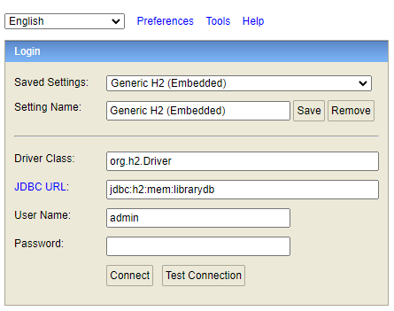
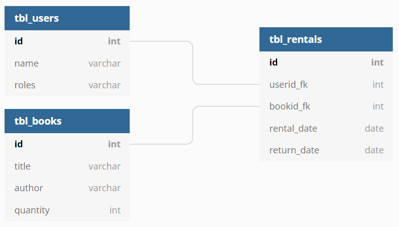

# Lista przydanych zapytań w języku SQL

## Dostęp do konsoli bazy danych H2
* [http://localhost:8080/h2-console](http://localhost:8080/h2-console)
  


## Schemat bazy danych



## Operacje na tabeli użytkowników
* Pobranie listy wszystkich użytkowników
```sql 
SELECT * FROM tbl_users
```
* Pobranie wszystkich użytkowników o podanym identyfikatorze
```sql 
SELECT * FROM tbl_users WHERE id = ?
```
* Usuwanie użytkowników o podanym identyfikatorze
```sql 
DELETE tbl_users where id = ?
```
* Dodawanie użytkownika o podanym identyfikatorze
```sql 
INSERT INTO tbl_users (name, roles) VALUES (?, ?)
```

## Operacje na tabeli książek
* Pobranie listy wszystkich książek
```sql 
SELECT * FROM tbl_books
```
* Pobranie wszystkich książek o podanym identyfikatorze
```sql 
SELECT * FROM tbl_books WHERE id = ?
```
* Pobranie liczby wypożyczonych egzemplarzy książki o podanym identyfikatorze
```sql 
SELECT COUNT(*) FROM tbl_rentals WHERE bookid_fk = ? AND return_date IS NULL
```
* Pobranie liczby dostępnych egzemplarzy książki o podanym identyfikatorze
```sql 
SELECT quantity FROM tbl_books WHERE id = ?
```
* Pobranie listy dostępnych książek (liczba dostępnych egzemplarzy większa niż liczba wypożyczonych)
```sql 
SELECT * FROM tbl_books WHERE id NOT IN (
    SELECT DISTINCT tbl_books.id FROM tbl_books JOIN tbl_rentals ON (tbl_books.id = tbl_rentals.bookid_fk) 
        WHERE return_date IS NULL GROUP BY tbl_books.id HAVING tbl_books.quantity <= count(*)
    )
```

## Operacje na tabeli wypożyczeń
* Pobranie liczby książek nie zwróconych przez użytkownika o podanym identyfikatorze
```sql 
SELECT COUNT(*) FROM tbl_rentals WHERE userid_fk = ? AND return_date IS NULL
```
* Pobranie histori wypożyczeń dla książki o podanym identyfikatorze
```sql 
SELECT tbl_rentals.*, tbl_users.name FROM tbl_rentals JOIN tbl_users ON tbl_rentals.userid_fk = tbl_users.id WHERE bookid_fk = ?
```
* Dodanie do historii wypożyczeń informacji o wypożyczeniu (w dniu dzisiejszym) książki przez użytkownika
```sql 
INSERT INTO tbl_rentals (userid_fk, bookid_fk, rental_date) VALUES(?,?, CURRENT_DATE())
```
* Dodanie do historii wypożyczeń informacji o zwrocie (w dniu dzisiejszym) książki przez użytkownika
```sql 
UPDATE tbl_rentals SET return_date = CURRENT_DATE() WHERE bookid_fk = ? AND userid_fk = ? AND return_date IS NULL
```